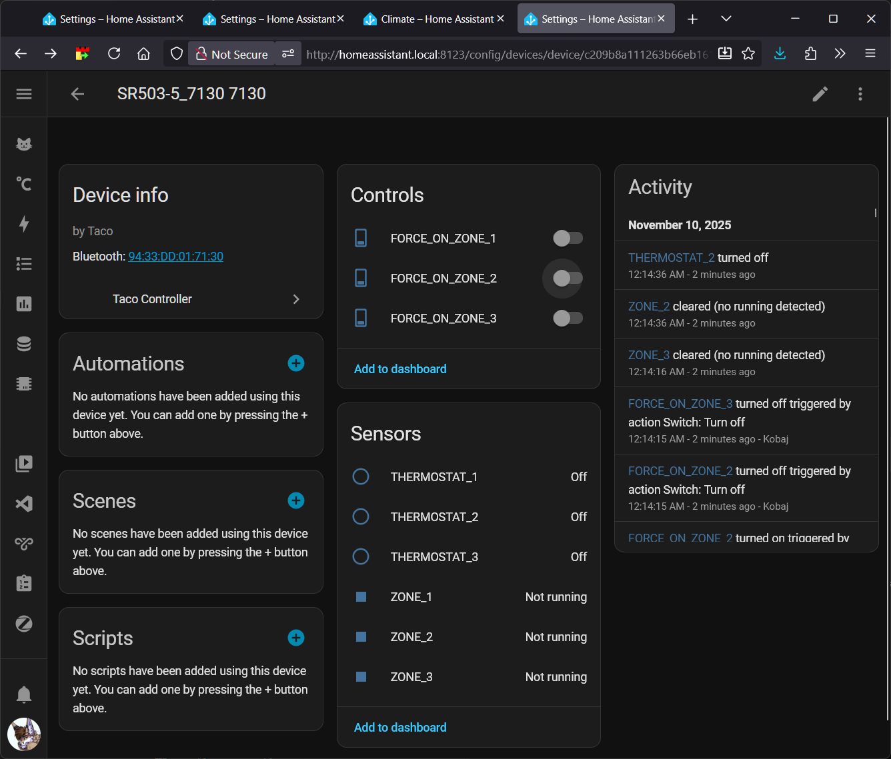
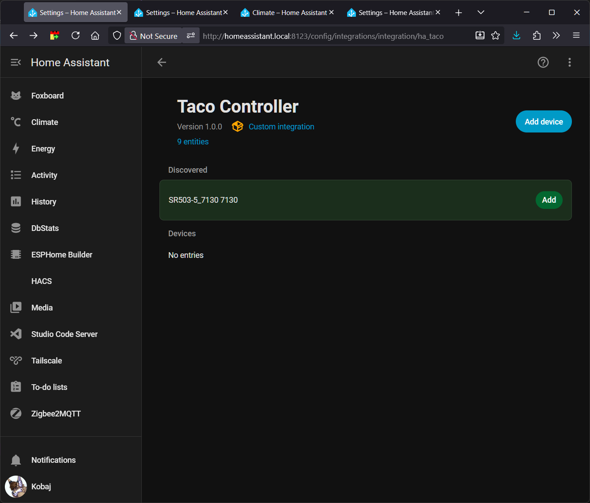
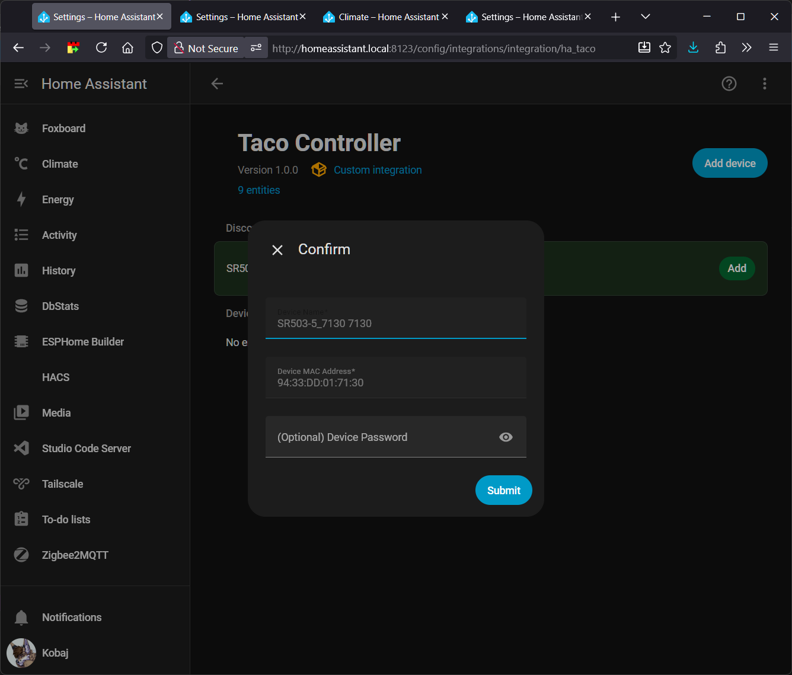
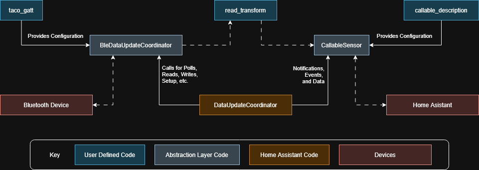

## About

Note: The primary repository is at https://gitlab.com/kobaj/ha_taco. Please make all pull requests and issues there.

Home Assistant Integration that allows you to manage a Taco pump and zone controller via its bluetooth interface.

Specifically this will allow you to see the status of your pumps, and the thermostats feeding them (eg, on or off). If you have the password to your Taco device (found on the inside of the green cover, printed on the circuit board) you can also override the pumps.

Follow both the Installation and Setup instructions below.



## Supported Models

Confirmed working with the following, however it should work with any bluetooth enabled Taco pump and zone controller.

|Model|HardwareRevision|Firmware|
|--|--|--|
|SR503|1|1.00.012|

## Installation

### HACS method (recommended)

This is based on the instructions at

1. Navigate to the HACS ui inside your home assistant instance.
1. Click on the 3 dots in the top right corner.
1. Select "Custom repositories"
1. Add the URL `https://github.com/kobaj/ha_taco` to the repository.
1. Select `Integration` as the type.
1. Click the "ADD" button.
1. Search for "Taco" in the HACS community store
1. Click "Download"!
1. Restart Home Assistant!

### Manual method (not recommended)

1. On your Home Assistant box, cd into your `config/custom_components` directory
1. Run `git clone git@gitlab.com:kobaj/ha_taco.git`
1. Restart Home Assistant!

## Setup

1. Navigate to your `Devices & services` inside of Home Assistant `Settings`
1. Click `Add New Integration` and search for `Taco`
1. [Optional] Add your password if you want to override the pumps

|  |  |
|--|--|
|||

## Debugging

To show log messages from this particular custom component then put the following in your configuration.yaml

```
logger:
  default: warning
  logs:
    custom_components.ha_taco: debug
```

## Development Architecture

This integration was written to be as modular and extensible as possible. Anything inside of the src folder not prefixed with `taco_` is 100% reusable for another project.

The overall philosophy was to introduce layers of abstraction between key elements. So Home Assistant sensors don't actually know (or care) they are talking to a bluetooth device, and the same in reverse. Instead, Home Assistant will use simple concepts like read data with key `xyz`, and the bluetooth device only needs to know characteristic `abc` is providing some data. You as the developer don't need to worry about any of the complicated in low level information (eg: configuring home assistant entities, setting up bluetooth connections, etc), and instead just need to map `abc` to `xyz`.

#### Adding a new read operation

tldr: https://gitlab.com/kobaj/ha_taco/-/commit/f5da61fff94d255de6984428e954c706220f9845



`taco_gatt` is static configuration that details all of the [bluetooth gatt](https://bluetoothle.wiki/gatt) services and characteristics, including how the integration can read and write to them. For example, the following can be found inside of the `const.py` file.

```python
from .src.gatt import Gatt, Service, Characteristic, Property, ReadAction

_TACO_SERVICES = [
    Service(
        uuid="1b423141-e0eb-4d9e-a86b-dcabcc3565b9",
        name="ZoneControl",
        characteristics=[
            Characteristic(
                uuid="1b423159-e0eb-4d9e-a86b-dcabcc3565b9",
                name="networkDeviceIndex",
                properties=[Property.READ, Property.WRITE], # This characteristic can both read and write.
                read_action=ReadAction.POLL # In order to read this value, continously poll the device.
                read_transform=read_network_device_index_transform # Process the bytes received from the device.
            ),
        ],
    ),
]
```

`BleDataUpdateCoordinator` is responsible for polling and listening to notifications from bluetooth, and managing a bluetooth client. It can be found inside of the `src/ble_data_update_coordinator.py` file. For the most part this file should not need to ever be edited in order to support new read operations. It is just included here to showcase the general flow of data.

`read_transform` is a method you define in order to turn the bytes provided by the device into a string, integer, object, whatever for use in sensors. For example, you might implement the following as found inside of the `src/taco_gatt_read_transform.py` file.

```python
from dataclasses import dataclass

@dataclass
class ReadResult
  """A ReadResult like object is required."""

    key: str
    value: any

# This is the key that a sensor can use to look up this data.
NETWORK_DEVICE_INDEX = 'network_device_index'

def read_network_device_index_transform(bytez: bytearray) -> string:
    mac = my_bytearray.decode('utf-8')
    return ReadResult(NETWORK_DEVICE_INDEX, mac)
```

`CallableSensor` is a CallableSensor, CallableBinarySensor, CallableSwitch, etc that will listen for updates, and provide a method of you to consume data from. It can be found inside of the `src/callable_entity` file. For the most part this file should not need to ever be edited in order to support new read operations. It is just included here to showcase the general flow of data.

`callable_description` is static configuration that details the actual sensor, binary_sensor, switch, etc that is reading data for Home Assistant. For example you might implement the following as found inside of the `binary_sensor.py` file.

```python
from homeassistant.core import HomeAssistant

from homeassistant.components.sensor import SensorEntityDescription
from homeassistant.helpers.entity_platform import AddConfigEntryEntitiesCallback
from homeassistant.config_entries import ConfigEntry

from .src.taco_device_info import create_device_info, create_entity_id
from .src.taco_gatt_read_transform import NETWORK_DEVICE_INDEX
from .src.callable_entity import CallableSensor, CallableDescription

from .const import DOMAIN

callable_description = CallableDescription(
    entity_description=SensorEntityDescription(
        key=f"MAC_ADDRESS",
        # Other entity descriptions would go here too.
    ),
    # Here we read the key from data and push it into the sensor.
    value_fn=lambda data: data.get(NETWORK_DEVICE_INDEX, "unknown"),
)

async def async_setup_entry(
    hass: HomeAssistant,
    entry: ConfigEntry,
    async_add_entities: AddConfigEntryEntitiesCallback,
) -> None:
    """Set up sensors."""

    async_add_entities([
        CallableSensor(
            entry.runtime_data.update_coordinator,
            callable_description, # The sensor description, as defined above.
            name=callable_description.entity_description.key,
            unique_id=create_entity_id(entry, callable_description),
            device_info=create_device_info(DOMAIN, entry),
        )
    ])
```

Each component above is modular. If you want to skip using CallableEntity or BleDataUpdateCoordinator and manage different aspects of the data flow yourself, you can!

#### Adding a new write operation

Roughly the same, just in reverse. See `switch.py` as an example. A more thorough explanation and documentation will be provided in the future!
